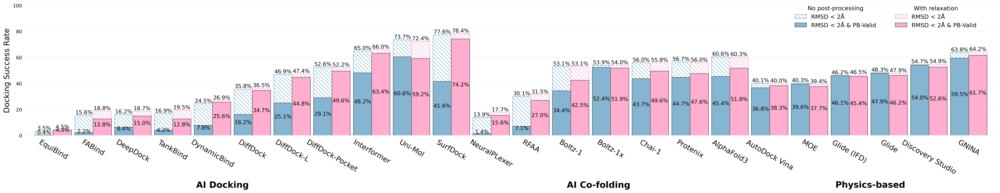
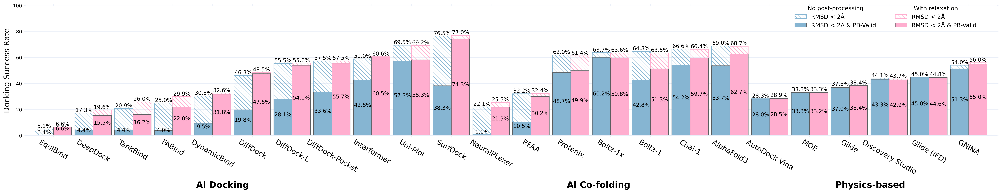

<div align="center">
  
</div>
<div>&nbsp;</div>

# PoseX: AI Defeats Physics-based Methods on Protein Ligand Cross-Docking

<div align="center">

[](https://arxiv.org/abs/2505.01700)
[](https://opensource.org/licenses/MIT)
[](https://www.repostatus.org/#active)

[](https://huggingface.co/datasets/CataAI/PoseX)
</div>

PoseX is a comprehensive benchmark dataset designed to evaluate molecular docking algorithms for predicting protein-ligand binding poses. It includes the construction process of Self-Docking and Cross-Docking datasets, as well as complete evaluation codes for different docking tools.

[Online Leaderboard](http://dock-lab.tech)

[Dataset Repository](https://huggingface.co/datasets/CataAI/PoseX)

---
<div align="center">
<h3>PoseX Self-Docking Result</h3>
</div>
<div align="center">
  
</div>
<div>&nbsp;</div>

<div align="center">
<h3>PoseX Cross-Docking Result</h3>
</div>
<div align="center">
  
</div>
<div>&nbsp;</div>

## Contents
- [PoseX: AI Defeats Physics-based Methods on Protein Ligand Cross-Docking](#posex-ai-defeats-physics-based-methods-on-protein-ligand-cross-docking)
  - [Contents](#contents)
  - [Installation](#installation)
  - [Benchmark Data](#benchmark-data)
  - [Benchmark Pipeline](#benchmark-pipeline)
    - [1. Generate Benchmark CSV Data](#1-generate-benchmark-csv-data)
    - [2. Convert to Model Inputs](#2-convert-to-model-inputs)
    - [3. Run Docking Models](#3-run-docking-models)
    - [4. Extract Model Outputs](#4-extract-model-outputs)
    - [5. Energy Minimization](#5-energy-minimization)
    - [6. Align Predicted Structures](#6-align-predicted-structures)
    - [7. Calculate Benchmark Result](#7-calculate-benchmark-result)
  - [Acknowledgements](#acknowledgements)
  - [License](#license)
  - [Citations](#citations)

## Installation

Install PoseX directly from Github to get the latest updates.
```bash
git clone https://github.com/CataAI/PoseX.git
cd PoseX
```
We recommend using `mamba` to manage the Python environment. For more information on how to install mamba, see [Miniforge](https://github.com/conda-forge/miniforge).
Once `mamba` is installed, we can run the following command to install the basic environment.
```bash
mamba create -f environments/base.yaml
mamba activate posex
```
For a specific molecular docking tool, we can use the corresponding environment file in the `environments` folder. Take `Chai-1` as an example:

```bash
pip install -r environments/chai-1.txt
```

## Benchmark Data
Download `posex_set.zip` and `posex_cif.zip` from [Dataset on HF](https://huggingface.co/datasets/CataAI/PoseX/tree/main)
```bash
mkdir data
unzip posex_set.zip -d data 
unzip posex_cif.zip -d data
mv data/posex_set data/dataset
```
For information about creating a dataset from scratch, please refer to the data construction [README](./dataset/README.md).

## Benchmark Pipeline

This project provides a complete pipeline for:
- Generate the csv file required for the benchmark based on the `PoseX` dataset
- Converting docking data into model-specific input formats
- Running different docking models or tools
- Energy minimization of molecular docking results
- Extracting and aligning model outputs
- Calculating evaluation metrics using `PoseBusters`


### 1. Generate Benchmark CSV Data

Generate benchmark CSV files containing protein sequences, ligand SMILES, and other metadata:

```bash
bash ./scripts/generate_docking_benchmark.sh <dataset>

# --------------- Example --------------- #
# Astex
bash ./scripts/generate_docking_benchmark.sh astex
# PoseX Self-Docking
bash ./scripts/generate_docking_benchmark.sh posex_self_dock
# PoseX Cross-Docking
bash ./scripts/generate_docking_benchmark.sh posex_cross_dock
```

### 2. Convert to Model Inputs

Convert benchmark CSV files to model-specific input formats:

```bash
bash ./scripts/convert_to_model_input.sh <dataset> <model_type>

# --------------- Example --------------- #
# PoseX Self-Docking (AlphaFold3)
bash ./scripts/convert_to_model_input.sh posex_self_dock alphafold3
```

### 3. Run Docking Models

Run different docking models:

```bash
bash ./scripts/run_<model_type>/run_<model_type>.sh <dataset>

# --------------- Example --------------- #
# PoseX Self-Docking (Alphafold3)
bash ./scripts/run_alphafold3/run_alphafold3.sh posex_self_dock
```

### 4. Extract Model Outputs

Extract predicted structures from model outputs:

```bash
bash ./scripts/extract_model_output.sh <dataset> <model_type>

# --------------- Example --------------- #
# PoseX Self-Docking (AlphaFold3)
bash ./scripts/extract_model_output.sh posex_self_dock alphafold3
```

### 5. Energy Minimization

```bash
python -m scripts.relax_model_outputs --input_dir <input_dir> --cif_dir data/posex_cif

# --------------- Example --------------- #
# PoseX Self-Docking (AlphaFold3)
python -m scripts.relax_model_outputs --input_dir data/benchmark/posex_self_dock/alphafold3/output --cif_dir data/posex_cif
```

### 6. Align Predicted Structures

Align predicted structures to the reference structures:

```bash
bash ./scripts/complex_structure_alignment.sh <dataset> <model_type> <relax_mode>

# --------------- Example --------------- #
# PoseX Self-Docking (AlphaFold3) (Using Relax)
bash ./scripts/complex_structure_alignment.sh posex_self_dock alphafold3 true
```

### 7. Calculate Benchmark Result

Calculate evaluation metrics using PoseBusters:

```bash
bash ./scripts/calculate_benchmark_result.sh <dataset> <model_type> <relax_mode>

# --------------- Example --------------- #
# PoseX Self-Docking (AlphaFold3) (Using Relax)
bash ./scripts/calculate_benchmark_result.sh posex_self_dock alphafold3 true
```
We provide the results [here](https://drive.google.com/drive/folders/16fqsisTEk4TdmZ-RfZNk14gG1vtLcnxh?usp=share_link).

## Acknowledgements
| Method                     | Pub. Year    | License            | Paper                    | Code|
|----------------------------|--------------|--------------------|--------------------------| ----| 
| **Physics-based methods**  |              |                    |                          |     |
| Discovery Studio           | late 1990s   | Commercial         |[](https://www.ajrconline.org/AbstractView.aspx?PID=2021-14-1-14)| - |
| Schrödinger Glide          | 2004         | Commercial         | [](https://pubmed.ncbi.nlm.nih.gov/15027865)| - |
| MOE                        | 2008         | Commercial         | [](https://pubmed.ncbi.nlm.nih.gov/19075767)| - |
| AutoDock Vina              | 2010, 2021   | Apache-2.0         | [](https://pubmed.ncbi.nlm.nih.gov/34278794) |[![][github-icon]](https://github.com/ccsb-scripps/AutoDock-Vina) |
| GNINA                      | 2021         | Apache-2.0         | [](https://pubmed.ncbi.nlm.nih.gov/34108002)  |[![][github-icon]](https://github.com/gnina/gnina) |
| **AI docking methods**     |              |                    |                          | |
| DeepDock                   | 2021         | MIT                | [](https://chemrxiv.org/engage/chemrxiv/article-details/60c757b7337d6cb764e29086) |[![][github-icon]](https://github.com/OptiMaL-PSE-Lab/DeepDock) |
| EquiBind                   | 2022         | MIT                | [](https://proceedings.mlr.press/v162/stark22b/stark22b.pdf) |[![][github-icon]](https://github.com/HannesStark/EquiBind) |
| TankBind                   | 2022         | MIT                | [](https://proceedings.neurips.cc/paper_files/paper/2022/file/2f89a23a19d1617e7fb16d4f7a049ce2-Paper-Conference.pdf) | [![][github-icon]](https://github.com/luwei0917/TankBind)|
| DiffDock                   | 2022         | MIT                | [](https://openreview.net/pdf?id=kKF8_K-mBbS) | [![][github-icon]](https://github.com/gcorso/DiffDock)|
| Uni-Mol                    | 2024         | MIT                | [](https://arxiv.org/abs/2405.11769) | [![][github-icon]](https://github.com/deepmodeling/Uni-Mol/tree/main/unimol_docking_v2)|
| FABind                     | 2023         | MIT                | [](https://openreview.net/pdf?id=PnWakgg1RL) | [![][github-icon]](https://github.com/QizhiPei/FABind)|
| DiffDock-L                 | 2024         | MIT                | [](https://openreview.net/pdf?id=UfBIxpTK10) |[![][github-icon]](https://github.com/gcorso/DiffDock) |
| DiffDock-Pocket            | 2024         | MIT                | [](https://openreview.net/pdf?id=1IaoWBqB6K) | [![][github-icon]](https://github.com/plainerman/DiffDock-Pocket)|
| DynamicBind                | 2024         | MIT                | [](https://www.nature.com/articles/s41467-024-45461-2) | [![][github-icon]](https://github.com/luwei0917/DynamicBind)|
| Interformer                | 2024         | Apache-2.0         | [](https://www.nature.com/articles/s41467-024-54440-6) |[![][github-icon]](https://github.com/tencent-ailab/Interformer) |
| SurfDock                   | 2024         | MIT                | [](https://www.nature.com/articles/s41592-024-02516-y) |[![][github-icon]](https://github.com/CAODH/SurfDock) |
| **AI co-folding methods**  |              |                    |                          | | 
| NeuralPLexer               | 2024         | BSD                | [](https://arxiv.org/pdf/2209.15171) |[![][github-icon]](https://github.com/zrqiao/NeuralPLexer)  |
| RoseTTAFold-All-Atom       | 2023         | BSD                | [](https://pubmed.ncbi.nlm.nih.gov/38452047) |[![][github-icon]](https://github.com/baker-laboratory/RoseTTAFold-All-Atom)  |
| AlphaFold3                 | 2024         | CC-BY-NC-SA 4.0    | [](https://pubmed.ncbi.nlm.nih.gov/38718835/) |[![][github-icon]](https://github.com/google-deepmind/alphafold3)  |
| Chai-1                     | 2024         | Apache-2.0         | [](https://www.biorxiv.org/content/10.1101/2024.10.10.615955v1) |[![][github-icon]](https://github.com/chaidiscovery/chai-lab)  |
| Boltz-1                    | 2024         | MIT                | [](https://www.biorxiv.org/content/10.1101/2024.11.19.624167v4) |[![][github-icon]](https://github.com/jwohlwend/boltz)  |
| Boltz-1x                   | 2025         | MIT                | [](https://www.biorxiv.org/content/10.1101/2024.11.19.624167v4) |[![][github-icon]](https://github.com/jwohlwend/boltz)  |
| Protenix                   | 2025         | Apache-2.0         | [](https://www.biorxiv.org/content/10.1101/2025.01.08.631967v1) |[![][github-icon]](https://github.com/bytedance/Protenix)  |


## License
- **Code**: Licensed under the [MIT License](https://opensource.org/licenses/MIT). 
- **Dataset**: Licensed under [Creative Commons Attribution 4.0 International (CC-BY 4.0)](https://creativecommons.org/licenses/by/4.0/). See [PoseX Dataset](https://huggingface.co/datasets/CataAI/PoseX) for details.


[github-icon]: https://img.shields.io/badge/code-38C26D?style=flat&logo=GitHub&labelColor=555555

## Citations

If you are interested in our work or use our data and code, please cite the following article:

```bibtex
@misc{jiang2025posexaidefeatsphysics,
      title={PoseX: AI Defeats Physics Approaches on Protein-Ligand Cross Docking}, 
      author={Yize Jiang and Xinze Li and Yuanyuan Zhang and Jin Han and Youjun Xu and Ayush Pandit and Zaixi Zhang and Mengdi Wang and Mengyang Wang and Chong Liu and Guang Yang and Yejin Choi and Wu-Jun Li and Tianfan Fu and Fang Wu and Junhong Liu},
      year={2025},
      eprint={2505.01700},
      archivePrefix={arXiv},
      primaryClass={cs.LG},
      url={https://arxiv.org/abs/2505.01700}, 
}
```